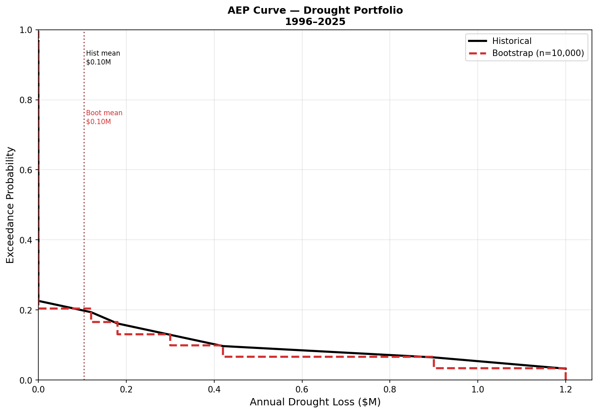
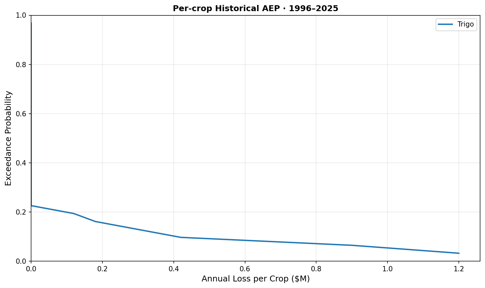
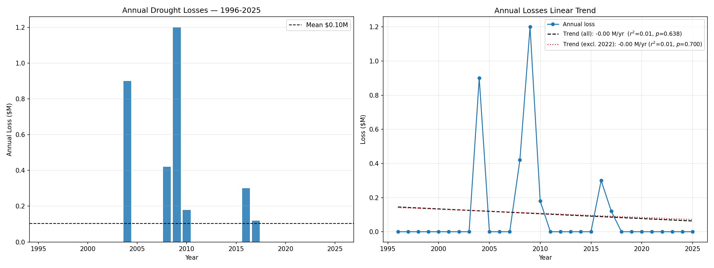
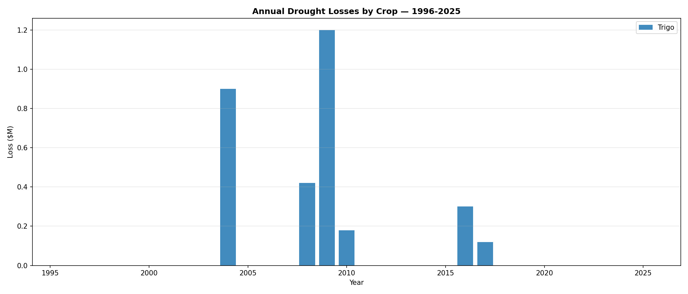

# Quality Assurance Report
## Pipeline Configuration & Parameters
### Loss Ranges per Hectare by Region
*   **Sur**: `$600.00` (Min) | `$750.00` (Mid) | `$900.00` (Max)
*   **Norte**: `$900.00` (Min) | `$1,050.00` (Mid) | `$1,200.00` (Max)

### Adjustments per Covered Hectare (Payout Structure)
*   **P1**: `100%`
*   **P5**: `40%`
*   **P10**: `20%`

## Data Contract Compliance
### ✅ `baseline_climatology.parquet`
*   **Path**: `/Users/ageidv/Library/CloudStorage/GoogleDrive-ageidv@gmail.com/My Drive/suyana/msu/pricing_pipeline/outputs/baseline_climatology.parquet`
*   **Status**: All data contract columns present.
*   **Found Columns**: `pixel_id, day_of_year, swc_mean`

### ✅ `cumulative_anomalies.parquet`
*   **Path**: `/Users/ageidv/Library/CloudStorage/GoogleDrive-ageidv@gmail.com/My Drive/suyana/msu/pricing_pipeline/outputs/cumulative_anomalies.parquet`
*   **Status**: All data contract columns present.
*   **Found Columns**: `year, pixel_id, Zona, region, Has, anomaly_sum, crop`

### ✅ `historical_percentiles.parquet`
*   **Path**: `/Users/ageidv/Library/CloudStorage/GoogleDrive-ageidv@gmail.com/My Drive/suyana/msu/pricing_pipeline/outputs/historical_percentiles.parquet`
*   **Status**: All data contract columns present.
*   **Found Columns**: `crop, pixel_id, P1, P5, P10`

### ✅ `historical_losses.parquet`
*   **Path**: `/Users/ageidv/Library/CloudStorage/GoogleDrive-ageidv@gmail.com/My Drive/suyana/msu/pricing_pipeline/outputs/historical_losses.parquet`
*   **Status**: All data contract columns present.
*   **Found Columns**: `crop, year, Zona, pixel_id, trigger_tier, loss_usd, region, Has, anomaly_sum, P1, P5, P10`

### ✅ `aggregate_annual_losses.parquet`
*   **Path**: `/Users/ageidv/Library/CloudStorage/GoogleDrive-ageidv@gmail.com/My Drive/suyana/msu/pricing_pipeline/outputs/aggregate_annual_losses.parquet`
*   **Status**: All data contract columns present.
*   **Found Columns**: `crop, year, loss_usd`

### ✅ `aep_curves.parquet`
*   **Path**: `/Users/ageidv/Library/CloudStorage/GoogleDrive-ageidv@gmail.com/My Drive/suyana/msu/pricing_pipeline/outputs/aep_curves.parquet`
*   **Status**: All data contract columns present.
*   **Found Columns**: `crop, rank, return_period_years, exceedance_probability, loss_usd`

### ✅ `pricing_quote.parquet`
*   **Path**: `/Users/ageidv/Library/CloudStorage/GoogleDrive-ageidv@gmail.com/My Drive/suyana/msu/pricing_pipeline/outputs/pricing_quote.parquet`
*   **Status**: All data contract columns present.
*   **Found Columns**: `crop, AAL_usd, StdDev_usd, technical_premium_usd, commercial_premium_usd`

## Sanity Checks
### Historical Percentiles
✅ **Passed**: Percentile ordering is mathematically sound.

|       |        P1 |        P5 |       P10 |
|:------|----------:|----------:|----------:|
| count |  2        |  2        |  2        |
| mean  | -0.681346 | -0.585496 | -0.504846 |
| std   |  0.138637 |  0.107084 |  0.103421 |
| min   | -0.779377 | -0.661216 | -0.577976 |
| 25%   | -0.730361 | -0.623356 | -0.541411 |
| 50%   | -0.681346 | -0.585496 | -0.504846 |
| 75%   | -0.63233  | -0.547636 | -0.468281 |
| max   | -0.583315 | -0.509776 | -0.431716 |

### Historical Losses
✅ **Passed**: All generated historical losses are non-negative.

|       |     loss_usd |
|:------|-------------:|
| count |     60       |
| mean  |  52000       |
| std   | 201728       |
| min   |      0       |
| 25%   |      0       |
| 50%   |      0       |
| 75%   |      0       |
| max   |      1.2e+06 |

### Empirical Trigger Frequencies
✅ **Passed**: Empirical trigger frequencies align with expected bounds.

| Tier         | Expected Frequency   | Observed Frequency   |   Total Activations |
|:-------------|:---------------------|:---------------------|--------------------:|
| P10 (<= P10) | 10.00%               | 10.00%               |                   6 |
| P5 (<= P5)   | 6.67%                | 6.67%                |                   4 |
| P1 (<= P1)   | 3.33%                | 3.33%                |                   2 |

### Pricing Logic
✅ **Passed**: Pricing logic sanity checks cleared.

| crop     |   AAL_usd |   StdDev_usd |   technical_premium_usd |   commercial_premium_usd |
|:---------|----------:|-------------:|------------------------:|-------------------------:|
| Combined |    104000 |       277844 |                  520766 |                   650957 |
| Trigo    |    104000 |       277844 |                  520766 |                   650957 |

### Cumulative Anomalies
✅ **Passed**: Anomalies generated successfully without nulls.

|       |   anomaly_sum |
|:------|--------------:|
| count |   60          |
| mean  |    0.00620888 |
| std   |    0.392962   |
| min   |   -0.813167   |
| 25%   |   -0.249479   |
| 50%   |    0.0252433  |
| 75%   |    0.292319   |
| max   |    0.735092   |

## Original Pipeline Checks
### Spatial Coverage
*   **Total Unique Pixels Validated**: `2` pixels

### Actuarial Triggers
*   **Total Trigger Events**: `6` triggers (`10.0%` of records)

### Financial Extremes
*   **Mean Annual Loss (Combined)**: `$0.10M`
*   **Max Annual Loss (Combined)**: `$1.20M` (Year 2009)

## Visualizations & Plots
To facilitate human review and quickly assess the pipeline outcomes, the structural plots are included below:

### 1. Annual Exceedance Probability (AEP)

### 2. Historical Loss Trends

## Final QA Status
✅ **SUCCESS**: All Quality Assurance Sanity Checks Passed!
